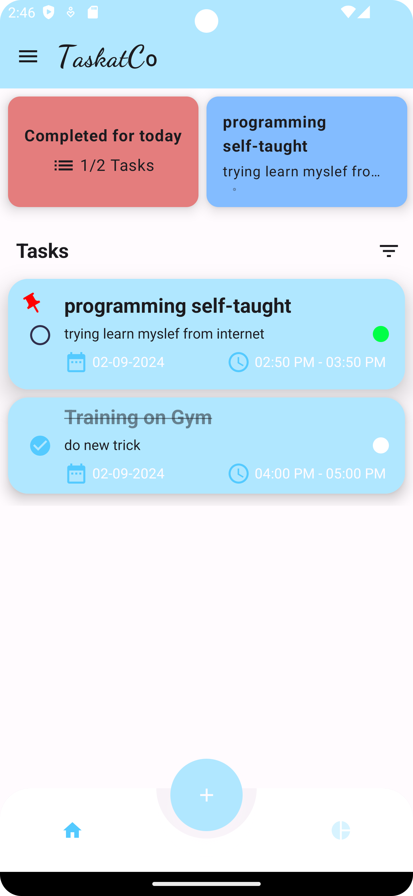
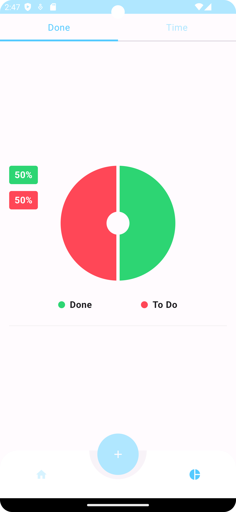

Hi there, I'm Khalid Ahmed
I made TaskatCo app to manage daily tasks and help user to commit their daily task.

I used the latest Android technologies :
* Jetpack Compose  and Material 3 for Ui
* Kotlin Coroutines & Flows
* Canvas
* Room Database & Data Store
* Dagger hilt 💉
* MVVM approach for clean architecture
* Alarm Manager to remind user on exact time

## 📷 Screenshots (Light theme)

<table style="width:100%">
<tr>
    <th>Empty Home</th>
    <th>Home</th> 
    <th>AddEdit</th>
  </tr>
  <tr>
    <td></td> 
    <td></td>
    <td></td> 
  </tr>
  <tr>
    <th>Done_Analysis</th>
    <th>Time_Analysis</th>
    <th>Drawer</th>
  </tr>
  <tr>
    <td></td>
    <td></td>
    <td></td>

  </tr>

</table>

## 📷 Screenshots (Dark theme)

<table style="width:100%">
  <tr>
    <th>Empty Home</th>
    <th>Home</th> 
    <th>AddEdit</th>
  </tr>
  <tr>
    <td></td> 
    <td></td>
    <td></td> 
  </tr>
  <tr>
    <th>Done_Analysis</th>
    <th>Time_Analysis</th>
    <th>Drawer</th>
  </tr>
  <tr>
    <td></td>
    <td></td>
    <td></td>
  </tr>

</table>

